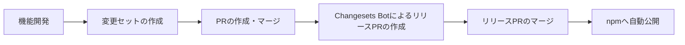

# リリース手順

このドキュメントは、Universe Alien Signalsプロジェクトのリリース手順を説明するものです。

<br />

## 前提条件

- `main` ブランチへのマージ権限
- GitHubリポジトリへの書き込み権限
- npmパッケージの公開権限（GitHub Actionsによって自動的に使用されます）

<br />

## Changesetsについて

[Changesets](https://github.com/changesets/changesets)は、バージョン管理とCHANGELOGの生成を自動化するツールです。

### 仕組み

1.  **変更セット（Changeset）**: 各変更は、`.changeset/*.md`というファイル形式で「変更セット」として記録されます。
2.  **バージョン計算**: 複数の変更セットを基に、次のバージョンが自動的に計算されます。
3.  **CHANGELOG生成**: 変更内容は、自動的に`CHANGELOG.md`へ追加されます。
4.  **自動リリース**: `GitHub Actions`と連携し、npmへ自動的に公開されます。

<br />

## リリースフロー



<br />

## 開発者の作業手順

### 1. 変更セットの作成

新しい機能や修正を実装した後、以下のコマンドで変更セットを作成します。

```bash
moon @:release
```

プロンプトの指示に従い、以下の項目を選択・入力してください。

1.  変更するパッケージを選択します。
2.  バージョンアップの種類を選択します。
    - **patch**: バグ修正など、後方互換性を保つ修正
    - **minor**: 後方互換性を保つ新機能の追加
    - **major**: 後方互換性のない破壊的変更
3.  変更内容の要約を入力します。この内容は`CHANGELOG`に記載されます。

### 2. プルリクエストの作成

変更セットを含むコミットをプッシュし、`main`ブランチへのプルリクエストを作成します。

```bash
git add .changeset/*
git commit -m "..."
git push origin feature/...
```

### 3. mainブランチへのマージ

プルリクエストのレビューが完了したら、`main`ブランチへマージします。
これで開発者の作業は完了です。

<br />

## 自動リリースプロセス

`main`ブランチへのマージ後、プロセスはすべて自動的に実行されます。

### 1. 変更セットの検出

`main`ブランチへのプッシュをトリガーに、GitHub Actions (`.github/workflows/release.yml`) が起動し、新しい変更セットの有無をチェックします。

### 2. リリースPRの自動作成・更新

変更セットが存在する場合、Changesets Botは以下のタスクを自動的に実行します。

- **「Version Packages」** という名前のプルリクエストを作成（または更新）します。
- 各パッケージの`package.json`のバージョンを更新します。
- `CHANGELOG.md`を自動で生成・更新します。
- 関連する依存関係も自動で更新します。

### 3. リリースPRの確認とマージ

開発者は、リリースPRの内容について以下の点を確認します。

- バージョン番号は適切か
- CHANGELOGの内容は正しいか
- 影響を受けるパッケージは正しいか

問題がなければ、リリースPRを手動でマージします。

### 4. 自動公開

リリースPRがマージされると、GitHub Actionsは以下のタスクを自動的に実行します。

- 更新されたパッケージをnpmに公開します。
- Gitタグを作成します。
- GitHub Releaseを作成します（設定されている場合）。

<br />

## パッケージごとのリリース

このリポジトリには、以下の複数のパッケージが含まれています。

- `@gn8/alien-signals-react`
- `@gn8/alien-signals-solid`
- `@gn8/alien-signals-vue`
- `@gn8/alien-signals-svelte`

各パッケージは独立してバージョン管理されますが、依存関係がある場合は連動して更新されます。

<br />

## トラブルシューティング

### 変更セットの削除

誤って変更セットを作成した場合は、以下のコマンドで削除します。

```bash
rm .changeset/*.md
git add .changeset/
git commit -m "chore: remove changeset"
```

### リリースPRが作成されない場合

- 変更セットが正しくコミットされているか確認してください。
- `.changeset/*.md`ファイルが存在するか確認してください。
- GitHub Actionsのログを確認してください。

### ビルドエラーが発生した場合

```bash
# 依存関係のクリア
moon @:clear-node-modules
bun install

# ビルドの再実行
moon :build
```

### 複数の変更セットの統合

複数のプルリクエストで作成された変更セットは、`main`ブランチで自動的に統合されます。
同じパッケージに対して複数の変更がある場合、最も大きいバージョンアップ（major > minor > patch）が適用されます。

**適用例**

- プルリクエスト1: `@gn8/alien-signals-react`に`patch`の変更
- プルリクエスト2: `@gn8/alien-signals-react`に`minor`の変更
- **結果**: `minor`としてバージョンアップされます。

<br />

## ベストプラクティス

### 変更セットの書き方

**良い例**

```
---
"@gn8/alien-signals-react": minor
---

feat: useSignalフックに自動的な依存関係追跡機能を追加

- signalの依存関係を自動で追跡します
- 不要な再レンダリングを削減し、パフォーマンスを向上させます
- useSignalに新しい`options`パラメータを追加しました
```

**悪い例**

```
---
"@gn8/alien-signals-react": patch
---

修正
```

### セマンティックバージョニング

- **patch** (0.0.X): バグ修正やドキュメント修正など。
- **minor** (0.X.0): 後方互換性を保つ新機能の追加。
- **major** (X.0.0): 後方互換性のない破壊的な変更。

<br />

## 環境変数

GitHub Actionsでは、以下の環境変数が使用されます。

- `GITHUB_TOKEN`: GitHub Actions用のトークンで、自動的に設定されます。
- `NPM_TOKEN`: npmパッケージ公開用のトークンで、リポジトリのSecretsに設定が必要です。

<br />

## リリース前チェックリスト

### 開発者の確認事項

- [ ] 変更内容に対して適切なバージョン種別を選択しているか
- [ ] 変更セットの説明は明確で分かりやすいか
- [ ] 関連するテストは追加されているか
- [ ] ドキュメントは更新されているか（必要な場合）

### リリースPRをマージする前の確認事項

- [ ] CI/CDパイプラインがすべて成功しているか
- [ ] CHANGELOGの内容は正確か
- [ ] バージョン番号は適切か
- [ ] 影響を受けるパッケージがすべて含まれているか

<br />

## 参考リンク

- [Changesets Documentation](https://github.com/changesets/changesets)
- [Changesets Action](https://github.com/changesets/action)
- [Moon Documentation](https://moonrepo.dev/docs)
- [Semantic Versioning](https://semver.org/)
